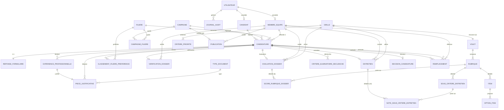

# CASA — Modèle Conceptuel de Données (MCD)

Lot 0 — Conception. Entités et attributs détaillés dans `docs/dictionnaire-donnees.md` ; ce document se concentre sur les **associations et cardinalités**. Notation MERISE (min,max).

## Entités (rappel)

**Identité** : UTILISATEUR, CANDIDAT, MEMBRE_EQUIPE
**Filières/campagnes** : FILIERE, CAMPAGNE, CAMPAGNE_FILIERE
**Candidature** : CANDIDATURE, REPONSE_FORMULAIRE, EXPERIENCE_PROFESSIONNELLE, CLASSEMENT_FILIERE_PREFERENCE, TYPE_DOCUMENT, PIECE_JUSTIFICATIVE
**Évaluation** : VERIFICATION_DOSSIER, EVALUATION_DOSSIER, SCORE_RUBRIQUE_DOSSIER, CRITERE_ELIMINATOIRE_DECLENCHE
**Entretien** : ENTRETIEN, NOTE_SOUS_CRITERE_ENTRETIEN
**Barème** : GRILLE, VOLET, RUBRIQUE, ITEM, OPTION_ITEM, SOUS_CRITERE_ENTRETIEN, CRITERE_PRIORITE
**Décision** : PUBLICATION, DECISION_CANDIDATURE, REMPLACEMENT
**Audit** : JOURNAL_AUDIT

## Spécialisation par rôle (CIF)

`UTILISATEUR` porte l'identité de connexion et le `role`. `CANDIDAT` et `MEMBRE_EQUIPE` sont deux sous-types exclusifs, sélectionnés par ce rôle (contrainte d'intégrité fonctionnelle — pas de CANDIDAT sans `role = candidat`, pas de MEMBRE_EQUIPE sans `role ∈ {evaluateur, administrateur}`).

```
UTILISATEUR (1,1) ──possède── (0,1) CANDIDAT
UTILISATEUR (1,1) ──possède── (0,1) MEMBRE_EQUIPE
```

## Associations principales

| Association | Entité A (card.) | Entité B (card.) | Notes |
|---|---|---|---|
| dépose | CANDIDAT (1,1) | CANDIDATURE (0,N) | Un candidat peut avoir plusieurs candidatures dans le temps (campagnes successives), une seule active à la fois en pratique (contrainte applicative, pas structurelle). |
| regroupe | CAMPAGNE (1,1) | CANDIDATURE (0,N) | |
| concerne | FILIERE (1,1) | CANDIDATURE (0,N) | Filière visée, confirmée dès l'inscription (règle produit : non modifiable après confirmation). |
| propose (quota) | CAMPAGNE (1,1) | CAMPAGNE_FILIERE (0,N) | Association N-N CAMPAGNE↔FILIERE porteuse du `quota`. |
| ouvre (quota) | FILIERE (1,1) | CAMPAGNE_FILIERE (0,N) | |
| répond | CANDIDATURE (1,1) | REPONSE_FORMULAIRE (1,1) | 1-1 stricte : une candidature a exactement un jeu de réponses. |
| déclare | CANDIDATURE (1,1) | EXPERIENCE_PROFESSIONNELLE (0,N) | |
| justifie (expérience) | EXPERIENCE_PROFESSIONNELLE (1,1) | PIECE_JUSTIFICATIVE (1,1) | Justificatif **obligatoire** (règle "1 expérience = 1 justificatif") — cardinalité (1,1) côté expérience. |
| dépose (pièce dossier) | CANDIDATURE (1,1) | PIECE_JUSTIFICATIVE (0,N) | Pièces du dossier (CNI, résidence, diplôme, CV, lettre, photo), distinctes du justificatif d'expérience. |
| type | TYPE_DOCUMENT (1,1) | PIECE_JUSTIFICATIVE (0,N) | Référentiel des 6 types de pièces du dossier. |
| classe | CANDIDATURE (1,1) | CLASSEMENT_FILIERE_PREFERENCE (0,N) | Association N-N CANDIDATURE↔FILIERE porteuse du `rang` de préférence (1 à 5). |
| préférée | FILIERE (1,1) | CLASSEMENT_FILIERE_PREFERENCE (0,N) | |
| fait l'objet de | CANDIDATURE (1,1) | VERIFICATION_DOSSIER (0,1) | 1-1 optionnelle : n'existe qu'une fois le dossier pris en instruction. |
| vérifie | MEMBRE_EQUIPE (0,1) | VERIFICATION_DOSSIER (0,N) | |
| fait l'objet de | CANDIDATURE (1,1) | EVALUATION_DOSSIER (0,1) | 1-1 optionnelle. |
| valide (dossier) | MEMBRE_EQUIPE (0,1) | EVALUATION_DOSSIER (0,N) | |
| utilise (dossier) | GRILLE (1,1) | EVALUATION_DOSSIER (0,N) | Version de grille utilisée — snapshot figé (décision validée). |
| détaille (score) | EVALUATION_DOSSIER (1,1) | SCORE_RUBRIQUE_DOSSIER (6,6) | Exactement 6 lignes (une par rubrique du volet Dossier). |
| porte sur | RUBRIQUE (1,1) | SCORE_RUBRIQUE_DOSSIER (0,N) | |
| déclenche | CANDIDATURE (1,1) | CRITERE_ELIMINATOIRE_DECLENCHE (0,N) | 0 à N critères déclenchés, tracés individuellement. |
| fait l'objet de | CANDIDATURE (1,1) | ENTRETIEN (0,1) | 1-1 optionnelle : n'existe qu'une fois le dossier verrouillé. |
| conduit | MEMBRE_EQUIPE (1,1) | ENTRETIEN (0,N) | |
| valide (entretien) | MEMBRE_EQUIPE (0,1) | ENTRETIEN (0,N) | |
| utilise (entretien) | GRILLE (1,1) | ENTRETIEN (0,N) | |
| détaille (sous-notes) | ENTRETIEN (1,1) | NOTE_SOUS_CRITERE_ENTRETIEN (10,10) | Exactement 10 lignes (sous-critères du volet Entretien). |
| porte sur | SOUS_CRITERE_ENTRETIEN (1,1) | NOTE_SOUS_CRITERE_ENTRETIEN (0,N) | |
| structure | GRILLE (1,1) | VOLET (2,2) | Exactement 2 volets (Dossier, Entretien) par version de grille. |
| compose | VOLET (1,1) | RUBRIQUE (1,N) | |
| détaille (item) | RUBRIQUE (1,1) | ITEM (0,N) | Volet Dossier uniquement. |
| propose (option) | ITEM (1,1) | OPTION_ITEM (1,N) | |
| détaille (sous-critère) | RUBRIQUE (1,1) | SOUS_CRITERE_ENTRETIEN (0,N) | Volet Entretien uniquement. |
| ordonne | GRILLE (1,1) | CRITERE_PRIORITE (1,N) | |
| est publiée par | CAMPAGNE (1,1) | PUBLICATION (0,1) | 1-1 optionnelle — **une campagne = au plus une publication** (décision validée : pas de flag global). |
| publie | MEMBRE_EQUIPE (1,1) | PUBLICATION (0,N) | |
| fait l'objet de | CANDIDATURE (1,1) | DECISION_CANDIDATURE (0,1) | 1-1 optionnelle : n'existe qu'une fois classée. |
| devient indisponible | CANDIDATURE (0,1) | REMPLACEMENT (0,N) | Rôle "candidature sortante". |
| est promue | CANDIDATURE (0,1) | REMPLACEMENT (0,N) | Rôle "candidature entrante" — deux pattes distinctes vers CANDIDATURE. |
| effectue (remplacement) | MEMBRE_EQUIPE (1,1) | REMPLACEMENT (0,N) | |
| affectée à | MEMBRE_EQUIPE (0,1) | CANDIDATURE (0,N) | `evaluateur_id`. |
| génère | UTILISATEUR (1,1) | JOURNAL_AUDIT (0,N) | Auteur de l'action tracée — tout rôle confondu (admin, évaluateur ; un candidat ne déclenche pas d'entrée d'audit dans le périmètre actuel). |

## Diagramme (Mermaid `erDiagram`)



## Points de conception explicitement notés

- **Polymorphisme `piece_justificative`** : rattachée soit à une `candidature` (pièces du dossier), soit à une `experience_professionnelle` (justificatif), jamais les deux. Modélisé ici comme deux associations distinctes (MCD strict) ; le MLD (`docs/mld.md`) propose une implémentation à deux clés étrangères nullables avec contrainte `CHECK` d'exclusivité plutôt qu'une table polymorphe généreuse.
- **REMPLACEMENT** porte deux associations vers la même entité CANDIDATURE (sortante / entrante) : pattern MERISE classique de rôles multiples sur une même association.
- **GRILLE versionnée** : `EVALUATION_DOSSIER` et `ENTRETIEN` référencent chacun la version de `GRILLE` utilisée au moment du calcul (snapshot), pas la grille "courante" — une évolution future du barème n'altère jamais une évaluation déjà verrouillée.
