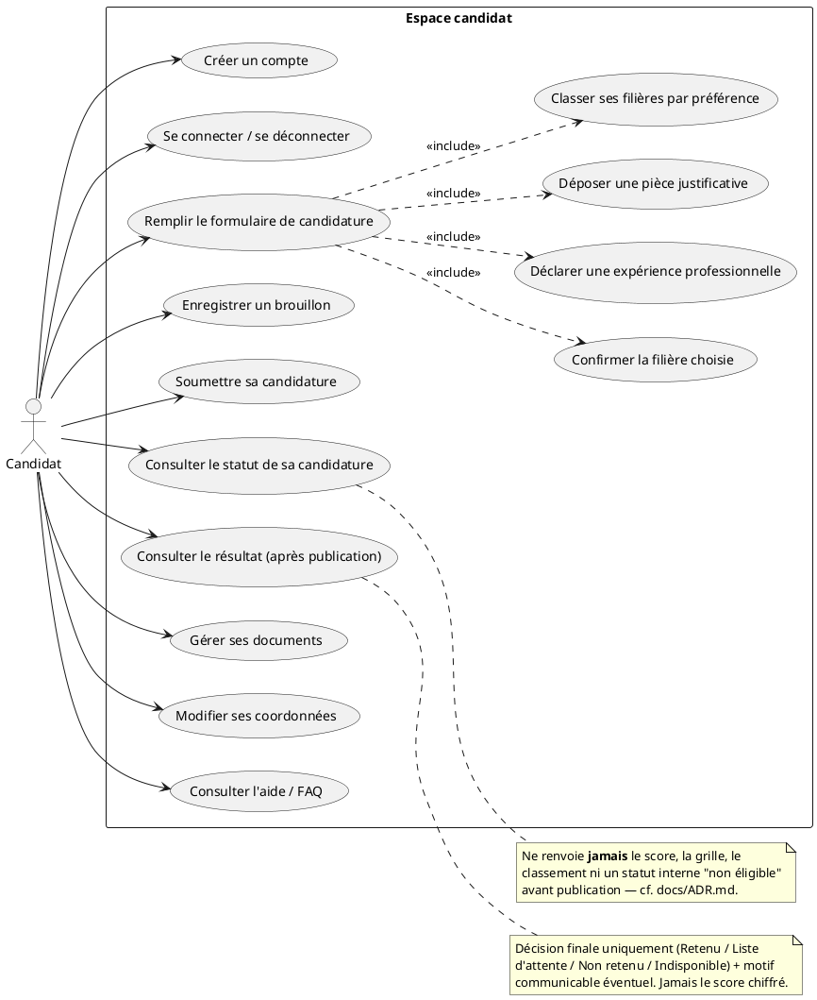
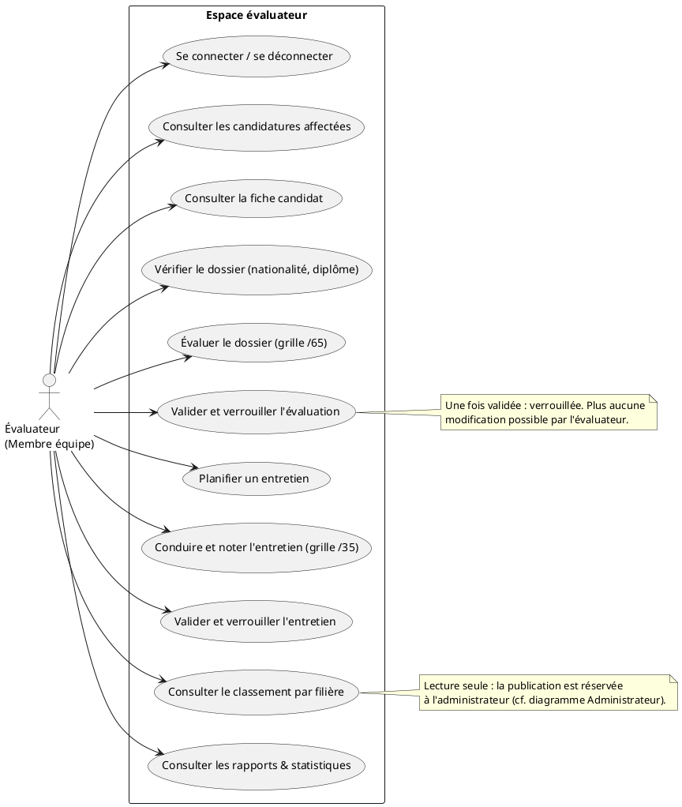
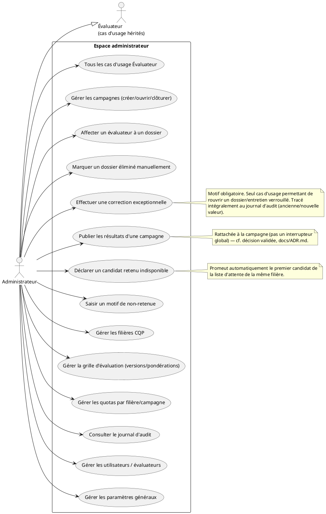

# CASA — Diagrammes de cas d'usage (UML)

Lot 0 — Conception. Format PlantUML (texte-versionnable). Un diagramme par rôle ; `Administrateur` inclut par hérédité tous les cas d'usage d'`Évaluateur` (règle validée : admin ⊇ évaluateur), plus ses cas propres.

## Candidat

## Évaluateur

## Administrateur

