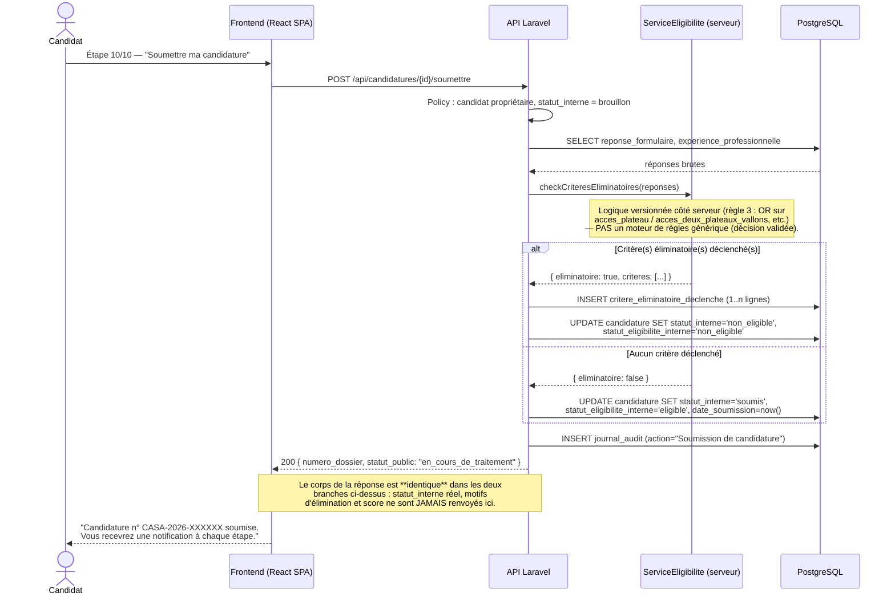
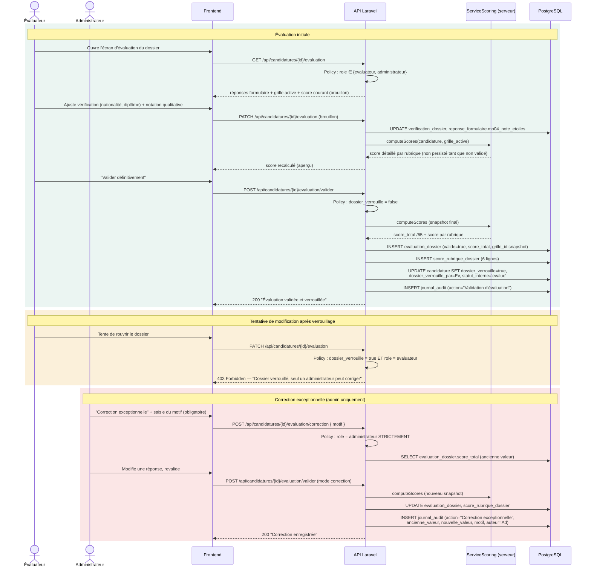
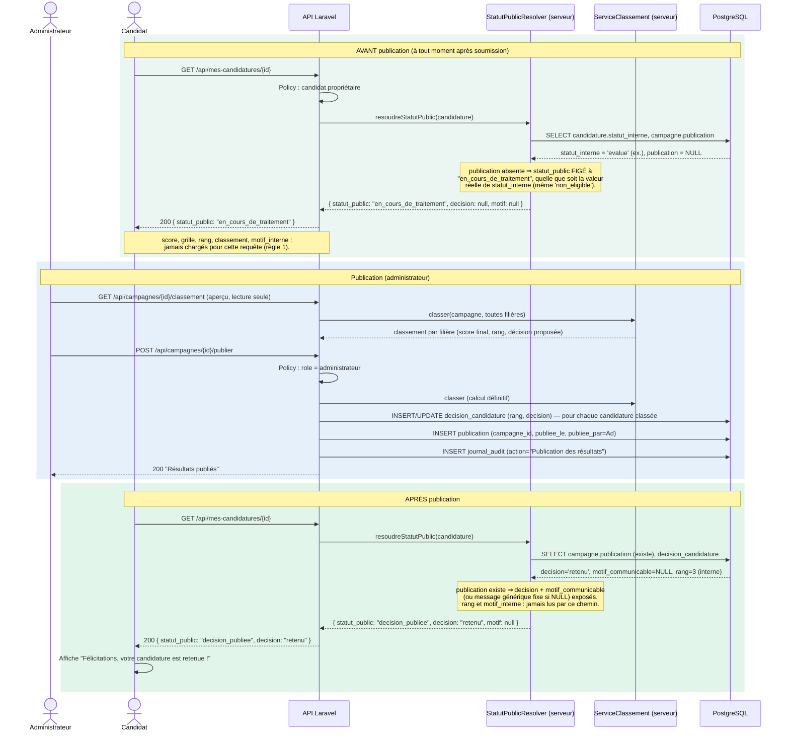

# CASA — Diagrammes de séquence (UML)

Lot 0 — Conception. Format Mermaid `sequenceDiagram` (texte-versionnable). Ces 3 séquences illustrent les workflows critiques et servent de spécification aux endpoints des lots d'implémentation ultérieurs — **aucun code n'est produit dans ce lot.**

## (a) Soumission d'une candidature + calcul d'éligibilité côté serveur

Illustre la règle 3 (logique OR sites) et la règle de communication différée dès la soumission (le candidat n'apprend jamais directement "non éligible").

## (b) Validation/verrouillage d'une évaluation + correction exceptionnelle admin

Illustre les règles 4 (verrouillage réel) et 5 (audit persistant).

## (c) Publication des résultats — ce que voit le candidat avant / après

Illustre la règle 1 (confidentialité côté serveur) et la règle 2 (communication différée). Le point clé : **un unique composant serveur (`StatutPublicResolver`) est le seul chemin de lecture autorisé pour un rôle candidat** — jamais un accès direct à `statut_interne`/`decision_candidature`.

## Principe transverse illustré par (c)

`StatutPublicResolver` (ou équivalent — Laravel API Resource dédiée, non contournable) est le **seul** point du code serveur autorisé à lire `candidature.statut_interne` et `decision_candidature` pour construire une réponse destinée à un rôle `candidat`. Aucun contrôleur candidat ne doit interroger ces colonnes directement. C'est la traduction opérationnelle de la règle 1 (confidentialité) et de l'exigence 2 (statut interne ≠ statut affiché, dès le modèle) — détaillée comme décision d'architecture dans `docs/ADR.md`.
